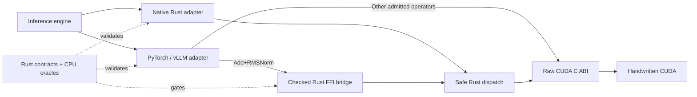

<div align="center">
  <h1>Loom Kernels</h1>
  <p><strong>Rust-first GPU operators for LLM inference.</strong></p>
  <p>Backend-independent contracts · handwritten CUDA · PyTorch and vLLM adapters · H20-qualified evidence</p>
  <p>
    <a href="docs/README.md">Documentation</a> ·
    <a href="docs/operator-catalog.md">Operator catalog</a> ·
    <a href="docs/guides/vllm-ir-provider.md">Integration guide</a> ·
    <a href="docs/results/README.md">H20 evidence</a> ·
    <a href="CHANGELOG.md">Changelog</a> ·
    <a href="https://feichai0017.github.io/loom-kernels/">Website</a>
  </p>
  <p>
    <a href="https://github.com/feichai0017/loom-kernels/actions/workflows/ci.yml"></a>
    <a href="https://github.com/feichai0017/loom-kernels/actions/workflows/ci_typos.yml"></a>
  </p>
</div>

Loom Kernels owns the narrow operator boundaries where fusion, layout-aware
execution, quantization, or fewer launches can improve a real inference path.
It is not an inference engine, tensor framework, or replacement for vendor
GEMM libraries.

> [!IMPORTANT]
> Loom is an alpha project. Engine integrations are opt-in and shape-gated;
> unsupported contracts fall back to the engine's native implementation.

## What Loom owns

| Layer | Responsibility |
| --- | --- |
| Contract | Dtypes, shapes, layouts, aliasing rules, capability queries, and invalid-input behavior |
| Reference | Deterministic CPU oracles used before accelerator timing |
| Execution | Safe Rust dispatch over a small C ABI and handwritten CUDA kernels |
| Integration | Current-stream PyTorch operators and narrow vLLM 0.24 registration points |
| Evidence | Reproducible correctness, named-baseline, CUDA Graph, and engine gates |

Dense GEMM stays with cuBLASLt, CUTLASS, or the engine-selected backend. Loom
targets the memory-bound work and useful epilogues around it.

## Supported operator paths

| Family | Operators | Qualified boundary |
| --- | --- | --- |
| Normalization | RMSNorm · Add+RMSNorm · RMSNorm→dynamic FP8 | F32, FP16, BF16; PyTorch and vLLM IR coverage |
| MLP | split-half SiLU-and-Mul · SiLU-and-Mul→block FP8 | F32, FP16, BF16; opt-in vLLM activation paths |
| Position and KV | NeoX/interleaved RoPE + paged-KV write | packed QKV, NHD/HND cache views, current-stream PyTorch |
| Decode tail | greedy + sampled logprob · selected-token logprob + rank · Min-P | exact-token/rank gates and measured vLLM fallbacks |
| Attention | paged MQA/GQA decode · local split-K/LSE merge | native paged KV, GQA reuse, short shape-gated vLLM route |

The [operator catalog](docs/operator-catalog.md) separates `supported`, `next`,
`planned`, `profile-gated`, and `vendor-backed` work. Catalog membership alone
is never a performance claim.

## Architecture



The backend either accepts the exact contract or declines it. Adapters do not
silently copy, cast, reshape, or change sampling policy to force a Loom path.
Add+RMSNorm is the first framework canary routed through
`loom-cuda-bridge`: PyTorch passes its existing pointers, element counts, and
current stream into checked Rust borrowed views before launch. Other operators
still call the raw CUDA C ABI directly and will migrate only after their own
correctness and engine gates close.

## Quick start

Use the backend-independent contracts from any Rust project:

```bash
cargo add loom-kernels@1.0.0-alpha.1
```

On a CUDA build host, add the safe GPU backend explicitly:

```bash
cargo add loom-cuda@1.0.0-alpha.1 --features cuda
```

The default workspace is dependency-light and does not require CUDA:

```bash
git clone https://github.com/feichai0017/loom-kernels.git
cd loom-kernels

cargo fmt --all -- --check
cargo clippy --workspace --all-targets -- -D warnings
cargo test --workspace --all-targets
cargo check --workspace --release
```

On an NVIDIA CUDA host, set the toolkit and target architecture explicitly:

```bash
CUDA_HOME=/usr/local/cuda-13.1 LOOM_CUDA_ARCHS=90 \
  cargo check -p loom-cuda --features cuda --release

CUDA_HOME=/usr/local/cuda-13.1 LOOM_CUDA_ARCHS=90 \
  cargo run -p loom-cuda --features cuda --release \
  --example rust_cuda_smoke

CUDA_HOME=/usr/local/cuda-13.1 LOOM_CUDA_ARCHS=90 \
  cargo bench -p loom-cuda --features cuda \
  --bench add_rms_norm -- \
  --dtype bf16 --rows 8 --hidden-size 4096
```

Build the optional Python bridge from a repository checkout:

```bash
python3 -m venv .venv-vllm
.venv-vllm/bin/pip install -e 'python[torch,test]'

CUDA_HOME=/usr/local/cuda-13.1 LOOM_CUDA_ARCHS=90 \
  .venv-vllm/bin/python python/build_native.py
CUDA_HOME=/usr/local/cuda-13.1 \
  .venv-vllm/bin/python python/build_torch_extension.py
```

The first build produces both the raw CUDA library and
`libloom_cuda_bridge.so`; the second links the PyTorch dispatcher against both.

See the [Python adapter README](python/README.md) for direct calls and the
[vLLM integration guide](docs/guides/vllm-ir-provider.md) for every opt-in and
fallback contract.

## Evidence, not blanket claims

The table below is a compact view of qualified NVIDIA H20 results. Each link
opens the raw JSON artifact used for the claim.

| Path | Qualified result | Claim boundary |
| --- | --- | --- |
| [Greedy + sampled logprob](docs/results/h20-greedy-sample-logprobs-20260722.json) | `3.16–4.35×` operator ratio; `1.129–1.250×` real-engine batch-latency ratio | Pure greedy requests with raw `logprobs=0` |
| [Selected-token logprob + rank](docs/results/h20-selected-token-logprobs-20260722.json) | `2.77–3.78×` operator ratio; `1.044–1.125×` real-engine batch-latency ratio | vLLM still owns top-k/top-p, RNG, and selection |
| [Min-P filtering](docs/results/h20-min-p-filter-20260722.json) | `1.885×` at 128 rows and no tensor-sized probability/mask temporaries | Smaller batches fall back to vLLM |
| [RoPE + paged-KV write](docs/results/h20-rope-paged-kv-20260722.json) | `2.30–2.40×` dispatcher ratio for 1–512 tokens | Real-engine invocation is proven; end-to-end remains at parity |
| [Short paged decode](docs/results/h20-vllm-paged-decode-backend-20260722.json) | `1.154–2.374×` across all 24 admitted backend cases | FP16/BF16, Hq/Hkv 32/8, D128, context ≤32; other shapes use FA3 |
| [Local split-K paged decode](docs/results/h20-paged-decode-split-k-20260722.json) | `1.14–6.22×` versus legacy Loom | Improves the Rust/CUDA backend; FA3 remains the long-context engine fallback |

> [!NOTE]
> A fast kernel is not automatically a faster model. Loom records operator,
> dispatcher, CUDA Graph, engine, and serving evidence as separate gates.
> Only artifacts under [`docs/results`](docs/results/README.md) support measured
> performance statements.

## Repository map

| Path | Purpose |
| --- | --- |
| `crates/loom-kernels` | Public Rust contracts, capabilities, and CPU references |
| `crates/loom-cuda` | Safe CUDA backend and oracle-backed benchmarks |
| `crates/loom-cuda-bridge` | Checked C boundary from framework-owned tensors into borrowed Rust dispatch |
| `crates/loom-cuda-sys` | Raw CUDA ABI, build plumbing, and packaged handwritten kernels |
| `python` | PyTorch dispatcher bridge and vLLM adapters |
| `benchmarks` | Named framework and engine baselines |
| `docs/results` | Hardware-qualified machine-readable evidence |
| `website` | Astro documentation site |

## Documentation

| Read | When you need it |
| --- | --- |
| [Documentation index](docs/README.md) | Choose the shortest path through the project |
| [Operator catalog](docs/operator-catalog.md) | Inspect the complete supported and planned surface |
| [Operator-library design](docs/design/operator-library.md) | Understand architecture and admission gates |
| [Paged-decode design](docs/design/paged-decode-attention.md) | Read cache layouts, split-K semantics, and exclusions |
| [vLLM provider guide](docs/guides/vllm-ir-provider.md) | Build, configure, validate, and benchmark engine adapters |
| [Implementation status](docs/status.md) | See what is implemented, validated, and still open |
| [Evidence index](docs/results/README.md) | Browse accepted, parity, fallback, and rejected experiments |
| [Roadmap](docs/roadmap.md) | Follow the next operator boundaries and exit criteria |
| [Changelog](CHANGELOG.md) | Review released surfaces and alpha compatibility boundaries |

## License

[MIT](LICENSE)
