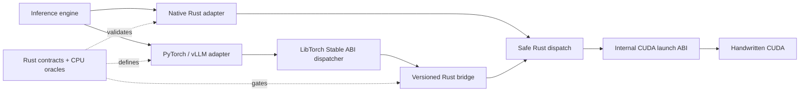

<div align="center">
  <h1>Loom Kernels</h1>
  <p><strong>Rust-first GPU operators for LLM inference.</strong></p>
  <p>Backend-independent contracts · handwritten CUDA · PyTorch and vLLM adapters · H20-qualified evidence</p>
  <p>
    <a href="docs/README.md">Documentation</a> ·
    <a href="docs/operator-catalog.md">Operator catalog</a> ·
    <a href="docs/compatibility.md">Compatibility</a> ·
    <a href="docs/guides/vllm-ir-provider.md">Integration guide</a> ·
    <a href="docs/results/README.md">H20 evidence</a> ·
    <a href="CONTRIBUTING.md">Contributing</a> ·
    <a href="CHANGELOG.md">Changelog</a> ·
    <a href="https://feichai0017.github.io/loom-kernels/">Website</a>
  </p>
  <p>
    <a href="https://github.com/feichai0017/loom-kernels/actions/workflows/ci.yml"></a>
    <a href="https://github.com/feichai0017/loom-kernels/actions/workflows/ci_typos.yml"></a>
  </p>
</div>

Loom Kernels owns the narrow operator boundaries where fusion, layout-aware
execution, quantization, or fewer launches can improve a real inference path.
It is not an inference engine, tensor framework, or replacement for vendor
GEMM libraries.

> [!IMPORTANT]
> Loom is an alpha project. Engine integrations are opt-in and shape-gated;
> unsupported contracts fall back to the engine's native implementation.

## What Loom owns

| Layer | Responsibility |
| --- | --- |
| Contract | Dtypes, shapes, layouts, aliasing rules, capability queries, and invalid-input behavior |
| Reference | Deterministic CPU oracles used before accelerator timing |
| Execution | Safe Rust dispatch over a small C ABI and handwritten CUDA kernels |
| Integration | Current-stream PyTorch operators and narrow vLLM 0.24/0.25 registration points |
| Evidence | Reproducible correctness, named-baseline, CUDA Graph, and engine gates |

Dense, quantized, sparse, and grouped GEMM always stay with cuBLASLt, CUTLASS,
FlashInfer, or the engine-selected backend. Loom targets the memory-bound work,
layout/scheduling metadata, and useful fusion boundaries around that matrix
core; it will not implement a competing GEMM.

## Supported operator paths

| Family | Operators | Qualified boundary |
| --- | --- | --- |
| Normalization | RMSNorm · Add+RMSNorm · RMSNorm→dynamic FP8 | F32, FP16, BF16; PyTorch and vLLM IR coverage |
| MLP | split-half SiLU-and-Mul · SiLU-and-Mul→block FP8 | F32, FP16, BF16; opt-in vLLM activation paths |
| Position and KV | NeoX/interleaved RoPE + native/static-FP8 paged-KV write | packed QKV, NHD/HND cache views, static per-tensor/per-head FP8 E4M3 scales, current-stream PyTorch |
| Decode tail | greedy + sampled logprob · selected-token logprob + rank · Min-P | exact-token/rank gates and measured vLLM fallbacks |
| Speculative decode | greedy draft verify + accepted/bonus-token compaction | flattened ragged int32 metadata, exact vLLM 0.24/0.25 rejection semantics, real vLLM 0.24 draft/target invocation |
| Attention | paged MQA/GQA decode · local split-K/LSE merge | native paged KV, GQA reuse, short shape-gated vLLM route |

The [operator catalog](docs/operator-catalog.md) separates `supported`,
`in progress`, `next`, `planned`, `profile-gated`, and `vendor-backed` work.
Catalog membership alone is never a performance claim.

## Next value program

K0.7's current bridge-ABI-2 native-wheel engineering gate is complete for
Linux x86_64, CUDA 13.1, SM90, Python 3.11, PyTorch 2.10/2.11, and vLLM
0.24/0.25. The exact artifact is qualified but not published to a package
index. The first
post-K0.7 slice is also complete: deterministic greedy speculative
verification and token compaction now follow the same Rust-owned path, and a
process-isolated Qwen2.5-1.5B/0.5B vLLM 0.24 gate proves exact native/Loom
speculative output with complete measured path coverage. That gate also shows
that the verifier is only `0.048-0.200%` of batch latency and that speculative
decode is `3.18-4.97x` slower than target-only for this workload. Further
speculative expansion is therefore profile-gated. The ordered feature program
is now:

| Order | Direction | First proof |
| --- | --- | --- |
| 1 | FP8 KV-cache compression | lower cache bytes and a larger admitted context or batch size with quality and TPOT reported |
| 2 | Complete sampling tail | penalties, top-k/top-p, deterministic RNG, and top-k logprobs through one engine path |
| 3 | KV-cache movement and quantization plumbing | measured prefix/preemption movement plus scale/pack/layout work around unchanged vendor GEMM |
| 4 | Profile-gated speculative extensions | tree/stochastic/KV work only after a named workload exposes a material non-GEMM boundary |
| 5 | MoE routing and movement | routing, histogram/prefix sum, permutation, and combine around vendor grouped GEMM |
| 6 | Minimal Rust decode proof | one zero-copy decode step over borrowed tensors and streams, without becoming an inference engine |

The first K3 slice extends the same fused RoPE+paged-KV operator to write
vLLM-compatible FP8 E4M3 cache bytes with static per-tensor or per-head scales.
One exact bridge-ABI-2 wheel now closes the H20 exact-byte, current-stream,
compile/graph, named-operator, clean-install, and real-engine invocation gates.
The physical cache allocation is `2x` smaller than BF16 at this operator
boundary, and the fused path is `1.317-1.378x` faster than vLLM's separate RoPE
and cache-write submissions across the measured sweep. It remains `in progress`
because the pretrained native-versus-FP8 quality, admitted-capacity, TTFT, and
TPOT gate is still open; order-reversed engine latency does not support a
stable model-level speedup claim. See the
[FP8 KV-cache design](docs/design/fp8-kv-cache.md).

The detailed contracts and exit criteria live in the
[roadmap](docs/roadmap.md).

## Architecture



Every framework operator follows this path. There is no Python/ctypes
implementation, unchecked dispatcher twin, direct C++-to-CUDA launch, or
layout-specific fallback inside Loom. PyTorch passes existing pointers,
physical storage spans, strides, and its current stream through the versioned
bridge through one LibTorch Stable ABI dispatcher targeting PyTorch 2.10;
Rust constructs checked borrowed views and selects the CUDA kernel. The backend
either accepts the exact contract or returns an error. Engine adapters decide
whether to call Loom before dispatch and retain the engine's native
implementation for unsupported semantics.

## Quick start

Use the backend-independent contracts from any Rust project:

```bash
cargo add loom-kernels@1.0.0-alpha.1
```

On a CUDA build host, add the safe GPU backend explicitly:

```bash
cargo add loom-cuda@1.0.0-alpha.1 --features cuda
```

The default workspace is dependency-light and does not require CUDA:

```bash
git clone https://github.com/feichai0017/loom-kernels.git
cd loom-kernels

cargo fmt --all -- --check
cargo clippy --workspace --all-targets -- -D warnings
cargo test --workspace --all-targets
cargo check --workspace --release
```

On an NVIDIA CUDA host, set the toolkit and target architecture explicitly:

```bash
CUDA_HOME=/usr/local/cuda-13.1 LOOM_CUDA_ARCHS=90 \
  cargo check -p loom-cuda --features cuda --release

CUDA_HOME=/usr/local/cuda-13.1 LOOM_CUDA_ARCHS=90 \
  cargo run -p loom-cuda --features cuda --release \
  --example rust_cuda_smoke

CUDA_HOME=/usr/local/cuda-13.1 LOOM_CUDA_ARCHS=90 \
  cargo bench -p loom-cuda --features cuda \
  --bench add_rms_norm -- \
  --dtype bf16 --rows 8 --hidden-size 4096
```

Build the native Python artifact from a clean Linux x86_64 checkout:

```bash
python3 -m venv .venv-wheel
.venv-wheel/bin/pip install \
  'setuptools>=80,<82' 'wheel>=0.45' build 'torch>=2.10,<2.12'

CUDA_HOME=/usr/local/cuda-13.1 LOOM_CUDA_ARCHS=90 \
  .venv-wheel/bin/python python/build_wheel.py \
  --cuda-home /usr/local/cuda-13.1 \
  --archs 90 \
  --wheel-dir dist

python3 -m venv .venv-loom
.venv-loom/bin/pip install \
  'dist/loom_kernels-1.0.0a1-2cu131torch210sm90-py3-none-linux_x86_64.whl[test]'
```

The wheel contains exactly `libloom_cuda_bridge.so` and the boxed
`libloom_kernels_torch.so` Stable ABI dispatcher, plus a manifest binding the
Git revision, CUDA toolkit, SM targets, runtime range, and library hashes. A
source-only wheel is rejected. The installed package validates that manifest
and loads only its packaged libraries; no repository checkout or library-path
override is used.

See the [Python README](python/README.md) for binary and editable development
flows, direct calls, and the
[vLLM integration guide](docs/guides/vllm-ir-provider.md) for every opt-in and
fallback contract. The [compatibility matrix](docs/compatibility.md) separates
source development, qualified framework versions, and the native-wheel
boundary.

## Evidence, not blanket claims

The table below is a compact view of qualified NVIDIA H20 results. Each link
opens the raw JSON artifact used for the claim.

| Path | Qualified result | Claim boundary |
| --- | --- | --- |
| [Greedy + sampled logprob](docs/results/h20-greedy-sample-logprobs-20260722.json) | `3.16–4.35×` operator ratio; `1.129–1.250×` real-engine batch-latency ratio | Pure greedy requests with raw `logprobs=0` |
| [Selected-token logprob + rank](docs/results/h20-selected-token-logprobs-20260722.json) | `2.77–3.78×` operator ratio; `1.044–1.125×` real-engine batch-latency ratio | vLLM still owns top-k/top-p, RNG, and selection |
| [Min-P filtering](docs/results/h20-min-p-filter-20260722.json) | `1.885×` at 128 rows and no tensor-sized probability/mask temporaries | Smaller batches fall back to vLLM |
| [Greedy speculative verify + compact](docs/results/h20-greedy-speculative-verify-20260723.json) | `1.101–1.128×` dispatcher ratio across 15 batch/draft shapes; bit-exact with vLLM | Deterministic all-greedy rejection only; the real-model gate is the next row |
| Real-model speculative decode: [native first](docs/results/h20-vllm-qwen25-speculative-native-first-20260723.json) · [Loom first](docs/results/h20-vllm-qwen25-speculative-loom-first-20260723.json) | Exact native/Loom tokens, `714/714` measured Loom calls per order; verifier share `0.048–0.200%` | Engine path proven; native/Loom latency crosses parity and speculative decode loses to target-only on this model pair |
| [RoPE + paged-KV write](docs/results/h20-rope-paged-kv-20260722.json) | `2.30–2.40×` dispatcher ratio for 1–512 tokens | Real-engine invocation is proven; end-to-end remains at parity |
| [Static FP8 KV-cache write](docs/results/h20-fp8-kv-cache-write-20260724.json) | Exact vLLM E4M3 bytes; `2×` BF16-to-FP8 cache storage ratio; `1.317–1.378×` operator ratio | Clean-wheel and real-engine invocation proven; native-vs-FP8 quality/capacity/serving gate remains open |
| [Short paged decode](docs/results/h20-vllm-paged-decode-backend-20260722.json) | `1.154–2.374×` across all 24 admitted backend cases | FP16/BF16, Hq/Hkv 32/8, D128, context ≤32; other shapes use FA3 |
| [Local split-K paged decode](docs/results/h20-paged-decode-split-k-20260722.json) | `1.14–6.22×` versus legacy Loom | Improves the Rust/CUDA backend; FA3 remains the long-context engine fallback |
| [LibTorch Stable ABI dispatcher](docs/results/h20-libtorch-stable-abi-20260723.json) | Same `.so`: 192 tests on PyTorch 2.11 with each vLLM minor; 123 applicable tests on PyTorch 2.10 | Historical source-built binary gate; the current packaged boundary is the next row |
| [Native ABI2 matrix wheel](docs/results/h20-native-wheel-clean-install-abi2-20260724.json) | Same wheel: 225 tests with each vLLM minor; 138 applicable tests on PyTorch 2.10 | Linux x86_64, CUDA 13.1, SM90, Python 3.11; exact artifact is qualified but not published |

> [!NOTE]
> A fast kernel is not automatically a faster model. Loom records operator,
> dispatcher, CUDA Graph, engine, and serving evidence as separate gates.
> Only artifacts under [`docs/results`](docs/results/README.md) support measured
> performance statements.

## Repository map

| Path | Purpose |
| --- | --- |
| `crates/loom-kernels` | Public Rust contracts, capabilities, and CPU references |
| `crates/loom-cuda` | Safe CUDA backend and oracle-backed benchmarks |
| `crates/loom-cuda-bridge` | Checked C boundary from framework-owned tensors into borrowed Rust dispatch |
| `crates/loom-cuda-sys` | Internal CUDA launch ABI, build plumbing, and packaged handwritten kernels |
| `python/csrc` | Stable ABI schemas plus domain-specific PyTorch tensor/stream adapters |
| `python/src/loom_kernels/vllm` | Public vLLM facade plus domain-specific registration policy |
| `benchmarks` | Named framework and engine baselines |
| `docs/results` | Hardware-qualified machine-readable evidence |
| `website` | Astro documentation site |

## Documentation

| Read | When you need it |
| --- | --- |
| [Documentation index](docs/README.md) | Choose the shortest path through the project |
| [Operator catalog](docs/operator-catalog.md) | Inspect the complete supported and planned surface |
| [Operator-library design](docs/design/operator-library.md) | Understand architecture and admission gates |
| [Code layout](docs/design/code-layout.md) | Trace an operator across contracts, CUDA, bridge, PyTorch, and vLLM |
| [Greedy speculative-verify design](docs/design/greedy-speculative-verify.md) | Read the ragged contract, ownership boundary, and deliberate exclusions |
| [FP8 KV-cache design](docs/design/fp8-kv-cache.md) | Read the static-scale write contract, qualified implementation boundary, and remaining system-value gate |
| [Paged-decode design](docs/design/paged-decode-attention.md) | Read cache layouts, split-K semantics, and exclusions |
| [vLLM provider guide](docs/guides/vllm-ir-provider.md) | Build, configure, validate, and benchmark engine adapters |
| [Compatibility matrix](docs/compatibility.md) | Check Rust, CUDA, PyTorch, vLLM, and binary distribution boundaries |
| [Implementation status](docs/status.md) | See what is implemented, validated, and still open |
| [Evidence index](docs/results/README.md) | Browse accepted, parity, fallback, and rejected experiments |
| [Roadmap](docs/roadmap.md) | Follow the next operator boundaries and exit criteria |
| [Changelog](CHANGELOG.md) | Review released surfaces and alpha compatibility boundaries |
| [Contributing](CONTRIBUTING.md) | Propose and validate an operator or integration change |

## License

[MIT](LICENSE)
