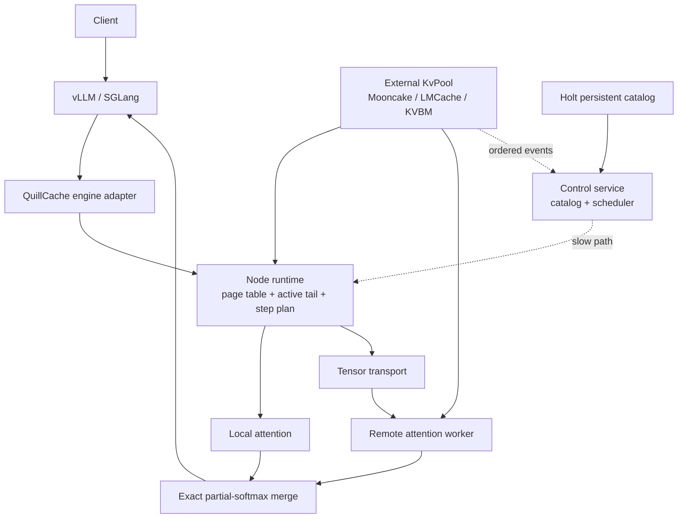

# QuillCache Architecture v2

## Positioning

QuillCache is a distributed core-attention runtime attached to external KV
pools. It does not own a general-purpose KV store and does not execute the full
transformer model.



## Ownership

The engine owns model execution. The pool owns sealed KV objects. QuillCache
owns compute coordination and transient sequence state.

An active tail stays on the model worker until it fills a complete pool object.
Publishing transfers ownership to the pool. The runtime then consumes the
sealed object through a generation-checked `PoolObjectRef` and read lease.

## Slow And Fast Paths

The control service consumes pool events, maintains the hot directory, persists
stable object references, and computes placement policy. Its decisions operate
at request and control-loop granularity.

The node runtime executes on the model-forward critical path. `begin_step`
freezes a page-table generation and its leases. Every layer uses that cached
plan. `commit_step` succeeds only if the sequence and page-table generations
still match.

## Split-KV Attention

For KV shard `i`, the worker returns:

```text
m_i = max(logits_i)
l_i = sum(exp(logits_i - m_i))
u_i = sum(exp(logits_i - m_i) * V_i)
```

The merger computes:

```text
m = max(m_i)
l = sum(exp(m_i - m) * l_i)
u = sum(exp(m_i - m) * u_i)
O = u / l
```

This is mathematically equivalent to attention over concatenated KV shards.
Communication grows with query/output dimensions rather than historical KV
length.

## Catalog Semantics

The hot directory is derived from ordered pool events and contains ephemeral
replica handles. A worker epoch change invalidates every live handle from the
old process.

Holt persists only stable metadata:

```text
IdentityScope + prefix + layer + block
  -> PoolObjectRef + KvLayout + durable replica hints
```

Every recovered object is revalidated against its pool before use. Holt cannot
extend a lease, prove an HBM pointer is live, or override a pool deletion.

## Execution Modes

| Mode | Use when |
| --- | --- |
| `Local` | required KV is already in local HBM |
| `RouteQuery` | a compute-capable remote worker owns the KV and Q/O is cheaper than KV movement |
| `StageKv` | the pool location cannot execute attention or local execution is cheaper |
| `Sharded` | disjoint KV shards can execute concurrently and merge exactly |
| `NeedsRecompute` | no generation-valid, identity-valid leased copy exists |

Recompute is an outer-engine action. A core-attention worker has no model weights
and cannot reconstruct preceding transformer layers by itself.

## Failure Invariants

1. Only `Ready` replicas may enter a page table.
2. Attention cannot begin with an expired read lease.
3. A worker epoch change invalidates prior live handles.
4. Only one mutable step may update a sequence at a time.
5. A stale plan cannot commit a new tail.
6. Partial results with incompatible shapes cannot be merged.
7. Persistent catalog records never contain raw device addresses or rkeys.
