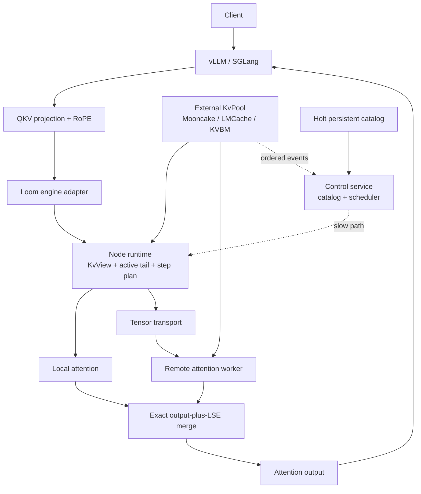

# Architecture

## Positioning

Loom is a disaggregated core-attention runtime attached to external KV
pools. The engine sends Q plus a generation-pinned historical KV view. It also
sends an optional K_new/V_new append to the worker that owns the mutable tail.
Loom returns the attention output; it owns neither model execution nor
authoritative KV lifetime.



## Ownership

The engine owns model execution. The pool owns sealed KV objects. Loom
owns compute coordination and transient sequence state.

An active tail stays on the model worker until it fills a complete pool object.
Publishing transfers ownership to the pool. The runtime then consumes the
sealed object through a generation-checked `PoolObjectRef` and read lease.

## Repository Boundaries

The Rust workspace has one package, `loom-attention`, with public `types`, `pool`,
`catalog`, `scheduler`, `attention`, `runtime`, and `transport` modules. The
same package builds the `loom-control` and `loom-worker` binaries. These
contracts share one release cadence; separate packages previously added
manifests and dependency plumbing without an independent release boundary.

Native CUDA kernels and Python engine adapters remain outside the Rust package
because they have independent language and accelerator toolchains.

## Slow And Fast Paths

The control service consumes pool events, maintains the hot directory, persists
stable object references, and computes placement policy. Its decisions operate
at request and control-loop granularity.

The node runtime executes on the model-forward critical path. `begin_step`
freezes a page-table generation and its leases. Every layer uses that cached
plan. `commit_step` succeeds only if the sequence and page-table generations
still match.

## Attention Operation

The primary operation carries registered tensor handles, not serialized tensor
bytes:

```text
Attend(Q, KvView, optional KvAppend, layout, mask, scale, deadline) -> O
```

`KvView` contains the ordered historical block identities, the page-table
generation, and the leases covering those blocks. Q and an optional
K_new/V_new append are produced after projection and RoPE. A sealed-prefix
worker receives Q only. The engine consumes O in its output projection,
residual, and FFN path.

Combining current-token KV append with attention preserves ordering without a
second remote synchronization. A worker may publish a newly sealed block after
the operation, but the external pool remains authoritative for its lifetime.

## Split-KV Attention

For KV segment `i`, the worker returns an attention state:

```text
O_i = softmax(S_i) V_i
LSE_i = logsumexp(S_i)
```

The merger computes:

```text
LSE = logsumexp_i(LSE_i)
O = sum_i(exp(LSE_i - LSE) * O_i)
```

This is mathematically equivalent to attention over concatenated KV segments
and matches the state contract exposed by FlashInfer. Communication grows with
query/output dimensions rather than historical KV length.

## Catalog Semantics

The hot directory is derived from ordered pool events and contains ephemeral
replica handles. A worker epoch change invalidates every live handle from the
old process.

Holt persists only stable metadata:

```text
IdentityScope + prefix + layer + block
  -> PoolObjectRef + KvLayout + durable replica hints
```

Every recovered object is revalidated against its pool before use. Holt cannot
extend a lease, prove an HBM pointer is live, or override a pool deletion.

## Execution Modes

| Mode | Use when |
| --- | --- |
| `Local` | required KV is already in local HBM |
| `RouteQuery` | a compute-capable remote worker owns the KV and Q/O is cheaper than KV movement |
| `StageKv` | the pool location cannot execute attention or local execution is cheaper |
| `Sharded` | disjoint KV shards can execute concurrently and merge exactly |
| `NeedsRecompute` | no generation-valid, identity-valid leased copy exists |

Recompute is an outer-engine action. A core-attention worker has no model weights
and cannot reconstruct preceding transformer layers by itself.

## Failure Invariants

1. Only `Ready` replicas may enter a page table.
2. Attention cannot begin with an expired read lease.
3. A worker epoch change invalidates prior live handles.
4. Only one mutable step may update a sequence at a time.
5. A stale plan cannot commit a new tail.
6. Partial results with incompatible shapes cannot be merged.
7. Persistent catalog records never contain raw device addresses or rkeys.
8. Historical KV cannot execute without a matching page-table generation and
   covering read leases.
