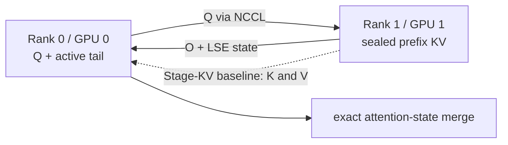

# Two-GPU Route-Q Acceptance Gate

## Purpose

This gate validates the first physical Loom data path on one Linux host with
two NVIDIA GPUs. It answers two separate questions:

1. Does Q-only remote-prefix attention plus exact local-tail merge produce the
   same output as full attention?
2. At what prefix size does Route-Q beat transferring the historical KV?

It does not claim production attention-kernel performance.

## Topology



Both ranks reconstruct identical deterministic tensors for the correctness
oracle. Only rank 1's prefix participates in the Route-Q execution. The extra
rank 0 copy is never included in the measured Route-Q path.

## Install

Use a CUDA-enabled PyTorch build with NCCL and two visible devices:

```bash
python3 -m pip install -e './python[cuda]'
```

To run the optimized contiguous-KV kernel path, install the FlashInfer extra:

```bash
python3 -m pip install -e './python[flashinfer]'
```

When running inside the vLLM environment, its existing compatible PyTorch
installation is sufficient:

```bash
python3 -m pip install -e ./python --no-deps
```

## Plan Without CUDA

```bash
loom-two-gpu-smoke plan \
  --prefix-tokens 4096 \
  --tail-tokens 16 \
  --rows 1 \
  --query-heads 32 \
  --kv-heads 8 \
  --head-dim 128 \
  --dtype float16
```

The command reports tensor payload bytes only. It excludes NCCL protocol,
launch, queueing, synchronization, and kernel costs.

The default correctness tolerance follows the attention-state wire dtype:
`2e-3` for FP16 and `2e-2` for BF16. Use `--atol` and `--rtol` to override it.

## Run

```bash
CUDA_VISIBLE_DEVICES=0,1 \
loom-two-gpu-smoke run \
  --prefix-tokens 4096 \
  --tail-tokens 16 \
  --rows 1 \
  --query-heads 32 \
  --kv-heads 8 \
  --head-dim 128 \
  --dtype float16 \
  --attention-backend flashinfer \
  --warmup 10 \
  --iterations 100 \
  --report build/two-gpu-smoke/report-4k.json
```

Repeat at 4K, 8K, 16K, 32K, and the largest feasible prefix. Keep every other
argument fixed when comparing the two paths.

## Route-Q Payload

Rank 0 sends Q. Rank 1 returns the attention output in the request dtype and
one FP32 log-sum-exp value for each row and query head:

```text
O_i = softmax(Q K_i^T) V_i
LSE_i = log(sum(exp(Q K_i^T)))
```

Rank 0 computes the same state over its active tail and merges each segment
with weights `exp(LSE_i - logsumexp(LSE))`. The returned payload is independent
of historical KV length and matches the contract exposed by optimized
attention kernels.

## Stage-KV Baseline

Rank 1 sends complete prefix K and V to preallocated buffers on rank 0. Rank 0
concatenates the local tail and computes full attention. This baseline transfers
KV on every measured iteration; it does not model amortization from retaining a
staged copy across later decode tokens.

That limitation is intentional. Later experiments must add reuse horizon and
eviction probability to determine when one Stage-KV transfer amortizes over
multiple future tokens.

## Valid Report

A reviewable report must contain:

- `passed: true` under the configured `atol` and `rtol`;
- GPU names, compute capability, CUDA, NCCL, and PyTorch versions;
- peer-access capability;
- complete workload configuration;
- p50/p99 latency and payload bytes for both paths;
- explicit `production_kernel: false` until the worker uses a paged optimized
  attention kernel.

The current macOS development host cannot produce this report. M2a remains open
until the harness runs on a Linux CUDA machine with two GPUs.

`--attention-backend reference` uses the PyTorch oracle for every path.
`--attention-backend flashinfer` uses FlashInfer
`single_decode_with_kv_cache(..., return_lse=True)` and `merge_states` for the
measured paths, while full attention remains the independent PyTorch oracle.
This backend still receives contiguous NHD KV; the paged external-pool executor
remains a separate milestone.
