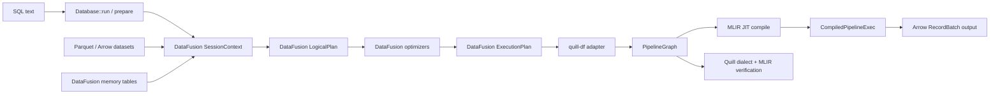

# QuillSQL Architecture

QuillSQL is a frontend-agnostic query compiler research engine. It does not
implement its own SQL parser, binder, cost optimizer, page store, WAL, SQL
catalog, or index manager. Frontend adapters translate external physical plans
into a neutral `PipelineGraph`; Arrow batches are the runtime transport; MLIR is
the compiler boundary.

## End-to-End Pipeline



## Storage Boundary

There is no QuillSQL-owned storage engine after the cleanup.

- Temporary or interactive data uses DataFusion's in-memory tables.
- Durable data should be registered as Parquet/Arrow datasets.
- DataFusion's catalog and file-source integrations define table visibility.
- QuillSQL's `DatabaseOptions::data_dir` is scratch state, not a private database
  file format.
- `DatabaseOptions::debug_trace` controls plan introspection. It is useful for
  interactive debugging, but benchmark paths disable it to avoid measuring
  trace-only planning work.

This makes the project better suited to OLAP/query-compiler research than OLTP
storage-engine research.

## JIT Boundary

The JIT boundary is `PipelineGraph` plus Arrow `RecordBatch`/fixed-width column
buffers. `quill-df` walks DataFusion physical plans, extracts supported physical
pipelines, and wraps compiled results as DataFusion `ExecutionPlan`s. The core
JIT and runtime crates do not depend on DataFusion.

The MLIR backend emits a formal Quill dialect module from `PipelineGraph`, verifies
that module through `melior`, and then lowers covered
pipeline specs to executable `scf/arith/llvm` modules. The physical optimizer can
replace filter/project and plain `SUM` pipelines with `CompiledPipelineExec`;
the current executable node runs fixed-width Arrow pipeline kernels implemented
in QuillSQL while carrying the MLIR pipeline descriptor and a structured
`PipelineSpec`. A narrow compiled `i64 -> bool` MLIR ExecutionEngine probe
validates scalar invocation. The compiled fixed-width path now has an `i64`
filter kernel that writes a byte selection mask, a multi-column
`filter -> project -> record_batch` kernel for `i64`, `f64`, `date32`, and
`decimal128` projection outputs, and a unified Quill-dialect
`filter -> plain SUM` lowering for both `f64` and Q6-shaped
`Date32`/`Decimal128` inputs. `CompiledPipelineExec` invokes the record and
scalar-sum kernels through thread-local MLIR execution caches when
`JitOptions::mlir_execution()` is selected and the input batch has no
nulls or slice offsets. The dispatch layer consumes `PipelineSpec`; it no longer
re-parses runtime expressions to guess input columns. CLI, server, and benchmark binaries map
`QUILL_JIT=mlir` to that option at startup. Unsupported expressions and unsafe
batch layouts fall back to the fixed-width Arrow runtime. Set `QUILL_JIT=off`
to keep a pure DataFusion physical plan for baseline measurements.

## Graph And Fusion

QuillSQL keeps one semantic pipeline graph plus an explicit lowering boundary:

- `PipelineGraph`: a linear pipeline prefix from a frontend physical plan,
  including the first `filter -> plain SUM` sink shape used as the stepping
  stone toward whole-pipeline lowering. It describes the executable subgraph
  selected for compilation; it is not a replacement SQL plan.
- `QuillDialectModule`: a formal Quill MLIR graph with `quill.source`,
  `quill.exec`, `quill.sink`, `quill.column`, and `quill.yield` operations.
  `filter`, `project`, `plain_sum`, and the grouped aggregate sink carry scalar
  work in single-block regions instead of string attributes.
- `crates/quill-mlir`: the C++/TableGen package that defines
  `!quill.batch`, `!quill.selection`, `!quill.row`, `!quill.scalar`, ODS
  verifiers, and the registered pass names `quill-canonicalize-pipeline` and
  `convert-quill-to-loops`.
- `PipelineLowering`: an exact pattern match from `PipelineGraph` to an executable
  record or aggregate kernel shape.

The first fusion patterns are deliberately small:

```text
Filter -> Projection
  => PipelineLowering::Record

Filter -> SUM(f64 expression)
Filter(Date32/Decimal128 comparisons) -> SUM(Decimal128 * Decimal128)
  => CompiledPipelineExec(kind=aggregate, sink=scalar_sum)

Group keys + SUM/COUNT/MIN/MAX aggregate inputs
  => quill.sink.group_aggregate dialect skeleton
```

`crates/quill-df/src/extract.rs` also recognizes the common DataFusion shape where a
round-robin `RepartitionExec` sits between the filter and projection, and
records that as an output adapter on the extracted pipeline. For plain
aggregates, it extracts the partial `SUM` pipeline and leaves DataFusion's final
aggregate in place. `crates/quill-df/src/rule.rs` only performs traversal and replacement;
it no longer constructs shape-specific execution nodes directly. The recognized
physical-plan shapes are also exposed as `PipelineGraph` candidates in debug traces,
so future
whole-pipeline lowering does not rely on string plan inspection. This lets the
project measure real operator boundaries before taking on executable grouped
aggregates, joins, hash repartitioning, or whole-query pipeline lowering. The
decimal path now has both a DataFusion-safe fixed-width Arrow runtime
specialization and an executable MLIR dispatch path for the same fixed-width
column layout, using the same Q6-shaped decimal `PipelineSpec`. The grouped
aggregate graph and dialect op are present as the Q1 extension point, but the
optimizer rule still leaves Q1 on DataFusion until the hash aggregate lowering
is implemented.

The intended compiler path is:

```text
frontend physical plan
  -> PipelineGraph
  -> Quill dialect
  -> lowering to scf/arith/llvm
  -> ExecutionEngine kernel
```

The current executable compiled kernels now share that route for the covered
fixed-width cases: multi-column record projection, `f64 filter/sum`, and the
Q6-shaped decimal `filter -> plain SUM` path. The remaining work is broadening
the dialect operations and lowering rules rather than adding more direct runtime
shortcuts.
